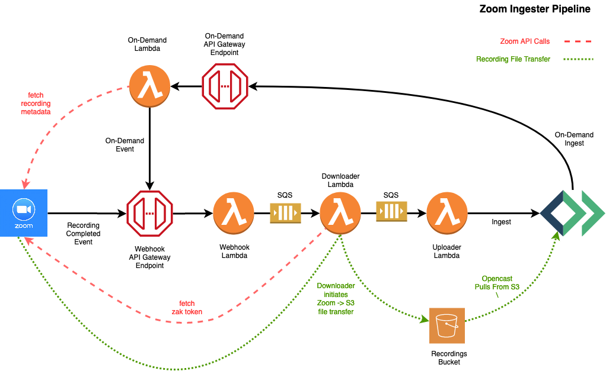

[](https://github.com/harvard-dce/zoom-recording-ingester/actions/workflows/checks.yml)

# Zoom Video Ingester

A set of AWS services for downloading and ingesting Zoom meeting videos into Opencast

## Overview

The Zoom Ingester (a.k.a., "Zoom Ingester Pipeline", a.k.a., "ZIP") is Harvard DCE's mechanism for moving Zoom
recordings out of the Zoom service and into our own video management and delivery system, Opencast. It allows DCE
to deliver recorded Zoom class meetings and lectures alongside our other, non-Zoom video content. 

When deployed, the pipeline will have an API endpoint that must be registered in your Zoom account as a receiver of
completed recording events. When Zoom has completed the processing of a recorded meeting video it will send a "webhook"
notification to the pipeline's endpoint. From there the recording metadata will be passed along through a series of queues 
and Lambda functions before finally being ingested into Opencast. Along the way, the actual recording files will be
fetched from Zoom and stored in S3. Alternatively, from the Opencast admin interface, a user can kick off an "on-demand"
ingestion by entering the identifier of a Zoom recording and the corresponding Opencast series into which it should be 
ingested. The On-Demand ingest function then fetches the recording metadata from the Zoom API and emulates a standard
webhook.

Info on Zoom's API and webhook functionality can be found at:
  * [developer portal](https://marketplace.zoom.us/docs/guides)
  * [webhooks](https://marketplace.zoom.us/docs/api-reference/webhook-reference)


## Pipeline flow diagram




* [Setup](#setup)

* [Development](#development)

* [Endpoints](#endpoints)

* [Testing](#testing)

* [Release Process](#release-process)

<!-- toc -->

## Setup

### Things you will need

##### Python stuff
* python 3.8+
* the python `virtualenv` package
* AWS CLI installed and configured [https://docs.aws.amazon.com/cli/latest/userguide/cli-chap-install.html](https://docs.aws.amazon.com/cli/latest/userguide/cli-chap-install.html)

##### node/cdk stuff

* node.js 10.3 or higher
* the `aws-cdk` node.js toolkit installed 
    * this is usually just `npm install -g aws-cdk`
    * it's best if the version matches the version of the `aws-cdk.core` package in `requirements/base.txt`
    * see [https://docs.aws.amazon.com/cdk/latest/guide/getting_started.html](https://docs.aws.amazon.com/cdk/latest/guide/getting_started.html) for more info
    
##### other stuff

* an Opsworks Opencast cluster, including:
    * the base url of the admin node
    * the user/pass combo of the Opencast API system account user
    * Opencast database password
* A Zoom account API key and secret
* Email of Zoom account with privileges to download recordings
* An email address to receive alerts and other notifications

### Create a CloudFormation stack

#### local environment setup

1. Make sure to have run `aws configure` at some point so that you 
   at least have one set of credentials in an `~/.aws/configure` file.
1. Make a python virtualenv and activate it however you normally do those things, e.g.: `virtualenv venv && source venv/bin/activate`
1. Python dependencies are handled via `pip-tools` so you need to install that first: `pip install pip-tools`
1. Install the dependencies by running `pip-sync requirements/dev.txt`.
1. Copy `example.env` to `.env` and update as necessary. See inline comments for an explanation of each setting.
1. If you have more than one set of AWS credentials configured you can set `AWS_PROFILE` in your `.env` file. Otherwise
   you'll need to remember to set in your shell session prior to any `invoke` commands.
1. Run `invoke test` to confirm the installation.
1. (Optional) run `invoke -l` to see a list of all available tasks + descriptions.
1. (Optional) If you plan to make contributions. Install the pre-commit checks with `pip install pre-commit && pre-commit install`.

#### deployment

1. Make sure your s3 bucket for packaged lambda code exists. The
name of the bucket comes from `LAMBDA_CODE_BUCKET` in `.env`. 
1. Run `invoke stack.create` to build the CloudFormation stack.
1. (Optional for dev) Populate the Zoom meeting schedule database. See the *Schedule DB* section below for more details.
    1. Export the DCE Zoom schedule google spreadsheet to a CSV file.
    1. Run `invoke schedule.import-csv [filepath]`.

That's it. Your Zoom Ingester is deployed and operational. To see a summary of the
state of the CloudFormation stack and the Lambda functions run `invoke stack.status`.

### Google Sheets integration setup

#### Google Sheets API Auth

1. Fill in Google Sheets environment variables `GSHEETS_DOC_ID` and `GSHEETS_SHEET_NAME`

Since these credentials are shared within an AWS account, the following setup
only needs to be done once per AWS account:
1. Set up a Google API service account and download the `service_account.json` credentials file.
1. Store the credentials file in SSM using `invoke schedule.save-creds [-f credentials-filename]`

#### Finding the ZIP stack API endpoint

The ZIP API endpoint is available in the output of `invoke stack.create`,
`invoke stack.update` and `invoke stack.status` under `Outputs`.

#### Setting up the schedule update trigger from Google Sheets

1. Share the Google Sheet with your service account
1. From the Google Sheet, under Tools > Script Editor, create a script.
The following script is an example which creates a menu item in the
Google Sheet that triggers the schedule update function.

```
function onOpen() {
  var ui = SpreadsheetApp.getUi();
  ui.createMenu('ZIP')
      .addItem('Update ZIP Schedule', 'updateZoomIngester')
      .addToUi();
}

function updateZoomIngester() {
  var url = "[your stack endpoint]";
  var options = {
  'method' : 'POST',
  };
  var response = UrlFetchApp.fetch(url, options);
  Logger.log(response);
  SpreadsheetApp
    .getActiveSpreadsheet()
    .toast(response.getContentText(), "Schedule Updated", 3);
}

```


### Setup Zoom webhook notifications (Optional)

Once the Zoom Ingester pipeline is operational you can configure your Zoom account to
send completed recording notifications to it via the Zoom Webhook settings.

1. Get your ingester's webhook endpoint URL. You can find it in the `invoke stack.status` output
or by browsing to the release stage of your API Gateway REST api.
1. Go to [marketplace.zoom.us](marketplace.zoom.us) and log in. Under "Develop" select "Build App."
1. Give your app a name. Turn off "Intend to publish this app on Zoom Marketplace."
Choose app type "Webhook only app."
1. Click "Create." Fill out the rest of the required information,
and enter the API endpoint under "Event Subscription."
1. Subscribe to the following events:

    For automatic ingests:. 
    * Recording - "All recordings have completed". 
    
    For status updates:

    * Recording - "Recording Started"
    * Recording - "Recording Paused"
    * Recording - "Recording Resumed"
    * Recording - "Recording Stopped"
    * Meeting - "End Meeting"
    * Webinar - "End Webinar"
1. Activate the app when desired. (For development it's recommended that you only leave the notifications active while you're actively testing.)


## Endpoints

The easiest way to find a listing of the endpoints for your stack is to run `invoke stack.status` and look in the **Outputs**. Identify the endpoints by their `ExportName`.

### Webhook Receiving Endpoint

**Description:** Receives webhook notifications from Zoom for ingests or status updates and receives on-demand ingest requests forwarded from the on-demand endpoint.

**Endpoint:** `POST /new_recording`  
**ExportName** : `<stack-name>-webhook-url`  

**Accepted Zoom webhook notifications for status updates:**

* "recording.started"
* "recording.stopped"
* "recording.paused"
* "recording.resumed"
* "meeting.ended"

**Accepted Zoom webhook notifications for ingests:**

* "recording.completed"

### On-Demand Endpoint (requests from Opencast only)

**Description:** Initiate a new on demand ingests from Opencast.

**Endpoint:** `POST /ingest`  
**ExportName:**`<stack-name>-ingest-url`

**Request Body Schema**

| Parameter      | Required?     | Type          | Description   |
| -------------  | ------------- |-------------  |-------------  |
| uuid           | Yes           | string        | Either the recording uuid or the link to the recording files. Recording files link example: `https://zoom.us/recording/management/detail?meeting_id=ajXp112QmuoKj4854875%3D%3D`  |
| oc\_series_id  | No            | string        | Opencast series id to ingest this recording to. Default: Recording only ingested if it matches the existing ZIP schedule.   |
| allow\_multiple_ingests  | No  | boolean       | Whether to allow the same Zoom recording to be ingested multiple times into Opencast. Default false. |

**Request Body Example**

	{
	    "uuid": "ajXp112QmuoKj4854875==",
	    "oc-series-id": "20210299999",
	    "allow_multiple_ingests": false
	}
	


### Schedule Update Endpoint

**Description:** Update the ZIP schedule.

**Endpoint:** `POST /schedule_update`  
**ExportName:** `<stack-name>-schedule-url`  
**Parameters:** No parameters. Retrieves schedule from stack associated google sheet.

### Status Endpoint (requests from Opencast only)

**Description:** Check the status of a recording.

**Endpoint:** `GET /status`  
**ExportName:** `<stack-name>-status-url`

**Request Path Parameters**

Provide only one of the following:

`meeting_id` - A Zoom meeting id.  
`seconds` - Retrieve status' updated within the last X seconds.

**Request Examples**

Retrieve all status' updated within the last 10 seconds:  
`GET https://<your-stack-endpoint-url>/status?seconds=10`

Retrieve current status of all recordings with Zoom meeting id 86168921331:  
`GET https://<your-stack-endpoint-url>/status?meeting_id=86168921331`


## Development

### Development Guide

1. Create a dev/test stack by setting your `.env` `STACK_NAME` to a unique value.
1. Follow the usual stack creation steps outlined at the top.
1. Make changes.
1. Run `invoke deploy.all --do-release` to push changes to your Lambda functions.
Alternatively, to save time, if you are only editing one function, run `invoke deploy.[function name] --do-release`.
1. If you make changes to the provisioning code in `./cdk` you must also (or instead) run 
    1. `invoke stack.diff` to inspect the changes
    1. `invoke stack.update` to apply the changes
1. Run `invoke exec.webhook [options]` to initiate the pipeline. See below for options.
1. Repeat.

##### `invoke exec.webhook [uuid]`

Options: `--oc-series-id=XX`

This task will recreate the webhook notification for the recording identified by
`uuid` and manually invoke the `/new_recording` api endpoint.

##### `invoke exec.pipeline [uuid]`

Options: `--oc-series-id=XX`

Similar to `exec.webhook` except that this also triggers the downloader and
uploader functions to run and reports success or error for each.

##### `invoke exec.on_demand [uuid]`

Options: `--oc-series-id=XXX --allow-multiple-ingests`

This task will manually invoke the `/ingest` endpoint. This is the endpoint used
by the Opencast "Zoom+" tool. Specify an opencast series id with `--oc-series-id=XX`.
Allow multiple ingests of the same recordiing (for testing purposes) with `--allow-multiple-ingests`.


### Schedule DB

Incoming Zoom recordings are ingested to an Opencast series based on two pieces of
information:

1. The Zoom meeting number. AKA the Zoom series id.
1. The time the recording was made

The Zoom Ingester pipeline includes a DynamoDB table that stores information about
when Zoom classes are held. This is because the same Zoom series id can be used by
different courses. To determine the correct Opencast series that the recording should
be ingested to we need to also know what time the meeting occurred.

The current authority for Zoom meeting schedules is a google spreadsheet. To populate
our DynamoDB from the spread sheet data we have to export the spreadsheet to CSV and then
import to DynamoDB using the `invoke schedule.import-csv [filepath]` task.

If a lookup to the DynamoDB schedule data does not find a mapping the uploader function will
log a message to that effect and return. During testing/development, this can be overridden
by setting the `DEFAULT_SERIES_ID` in the lambda function's environment. Just set that
to whatever test series you want to use and all unmapped meetings will be ingested to that series.

### Invoke task descriptions

This project uses the `invoke` python library to provide a simple task cli. Run `invoke -l`
to see a list of available commands. The descriptions below are listed in the likely order
you would run them and/or their importance.

##### `invoke stack.create`

Does the following:

1. Packages each function and uploads the zip files to your s3 code bucket
1. Builds all of the AWS resources as part of a CloudFormation stack using the AWS CDK tool
1. Releases an initial version "1" of each Lambda function

**Notes**:
* When running this command (and `stack.update` as well) you will be presented with a
  confirmation prompt to approve some of provisioning operations or changes, typical those realted
  to security and/or permissions
* The output from this command can be a bit verbose. You will see real-time updates from
  Cloudformation as resource creation is initiated and completed.

Use `stack.update` to modify an existing stack.

##### `invoke stack.status`

This will output some tables of information about the current state of the
CloudFormation stack and the Lambda functions.

##### `invoke codebuild --revision=[tag or branch]`

Execute the CodeBuild project. This is the command that should be used to deploy
and release new versions of the pipeline functions in a production environment.

`--revision` is a required argument.

The build steps that CodeBuild will perform are defined in `buildspec.yml`.

##### `invoke stack.diff`

View a diff of CloudFormation changes to the stack.

##### `invoke stack.update`

Apply changes to the CloudFormation stack.

##### `invoke stack.delete`

Delete the stack.

##### `invoke debug.{on,off}`

Enable/disable debug logging in the Lambda functions. This task adds or modifies
a `DEBUG` environment variable in the Lambda function(s) settings.

##### `invoke update-requirements`

Does a bulk `pip-compile` upgrade of all base and function requirements.


### Dependency Changes

Dependencies for the project as a whole and the individual functions are managed using
the `pip-tools` command, `pip-compile`. Top-level dependencies are listed in a `.in` file
which is then compiled to a "locked" `.txt` version like so:

`pip-compile requirements/dev.in`

Both the `.in` and `.txt` files are version-controlled, so the initial compile was
only necessary once. Now we only have to run `pip-compile` in a couple of situations:

* when upgrading a particular package.
* to update the project's base requirements list if a dependency for a specific function is changed

In the first case you run `pip-compile -P [package-name] [source file]` where `source_file` is the `.in` file getting the update.

Following that you must run `pip-compile` in the project root to pull the function-specific change(s) into the main project list.

Finally, run `pip-sync requirements/dev.txt` to ensure the packages are updated in your virtualenv .

## Testing

The lambda python functions each have associated unittests. To run them manually
execute:

`invoke test`

Alternatively you can run `tox`.

## Lambda Versions, Release Alias & Initial Code Release

Lambda functions employ the concepts of "versions" and "aliases". Each time you push new
code to a Lambda function it updates a special version signifier, `$LATEST`. If you wish
to assign an actual version number to what is referenced by `$LATEST` you "publish" a
new version. Versions are immutable and version numbers always increment by 1.

Aliases allow us to control which versions of the Lambda functions are invoked by the system.
The Zoom Ingester uses a single alias defined by the `.env` variable, `LAMBDA_RELEASE_ALIAS` (default "live"),
to designate the currently released versions of each function. A new version of each
function can be published independent of the alias as many times as you like. It is only
when the release alias is updated to point to one of the new versions that the behavior
of the ingester will change.

When you first build the stack using the above "Initial Setup" steps, the version of the Lambda functions
code will be whatever was current in your cloned repo. The Lambda function versions will
be set to "1" and the release aliases ("live") will be pointing to this same version.
At this point you may wish to re-release a specific tag or branch of the function code.
In a production environment this should be done via the CodeBuild project, like so:

    invoke codebuild -r release-v1.0.0

This command will trigger CodeBuild to package and release the function code from the github
repo identified by the "release-v1.0.0" tag. Each function will have a new Lambda version "2"
published and the release alias will be updated to point to this version.

## Release Process

### Step 1: Update master

Merge all changes for release into master.  
Checkout master branch, git pull.

### Step 2: Test release in dev stack

First check that the codebuild runs with the new changes on a dev stack:

If there are new functions you must package and ensure the code is in s3:

    invoke package -u

then

	invoke stack.update
	invoke codebuild --revision=master

Make sure codebuild completes successfully.

### Step 3: Tag management

First update your tags:

    git tag -l | xargs git tag -d
    git fetch --tags    


Then tag release:

    git tag release-vX.X.X
    git push --tags

### Step 4: Release to production stack

Make sure you are working on the correct zoom ingester stack, double check environment variables. Then:

If there are new functions you must package and ensure the code is in s3:

    invoke package -u
    
then

	invoke stack.update
	invoke codebuild --revision=release-vX.X.X
